IMPORTANT ❗ ❗ ❗ Please remember to destroy all the resources after each work session. You can recreate infrastructure by creating new PR and merging it to master.


                                                                                                                                                                                                                                                                                                                                                                                  
## Phase 1 Exercise Overview

  ```mermaid
  flowchart TD
      A[🔧 Step 0: Fork repository] --> B[🔧 Step 1: Environment variables\nexport TF_VAR_*]
      B --> C[🔧 Step 2: Bootstrap\nterraform init/apply\n→ GCP project + state bucket]
      C --> D[🔧 Step 3: Quota increase\nCPUS_ALL_REGIONS ≥ 24]
      D --> E[🔧 Step 4: CI/CD Bootstrap\nWorkload Identity Federation\n→ keyless auth GH→GCP]
      E --> F[🔧 Step 5: GitHub Secrets\nGCP_WORKLOAD_IDENTITY_*\nINFRACOST_API_KEY]
      F --> G[🔧 Step 6: pre-commit install]
      G --> H[🔧 Step 7: Push + PR + Merge\n→ release workflow\n→ terraform apply]

      H --> I{Infrastructure\nrunning on GCP}

      I --> J[📋 Task 3: Destroy\nGitHub Actions → workflow_dispatch]
      I --> K[📋 Task 4: New branch\nModify tasks-phase1.md\nPR → merge → new release]
      I --> L[📋 Task 5: Analyze Terraform\nterraform plan/graph\nDescribe selected module]
      I --> M[📋 Task 6: YARN UI\ngcloud compute ssh\nIAP tunnel → port 8088]
      I --> N[📋 Task 7: Architecture diagram\nService accounts + buckets]
      I --> O[📋 Task 8: Infracost\nUsage profiles for\nartifact_registry + storage_bucket]
      I --> P[📋 Task 9: Spark job fix\nAirflow UI → DAG → debug\nFix spark-job.py]
      I --> Q[📋 Task 10: BigQuery\nDataset + external table\non ORC files]
      I --> R[📋 Task 11: Spot instances\npreemptible_worker_config\nin Dataproc module]
      I --> S[📋 Task 12: Auto-destroy\nNew GH Actions workflow\nschedule + cleanup tag]

      style A fill:#4a9eff,color:#fff
      style B fill:#4a9eff,color:#fff
      style C fill:#4a9eff,color:#fff
      style D fill:#ff9f43,color:#fff
      style E fill:#4a9eff,color:#fff
      style F fill:#ff9f43,color:#fff
      style G fill:#4a9eff,color:#fff
      style H fill:#4a9eff,color:#fff
      style I fill:#2ed573,color:#fff
      style J fill:#a55eea,color:#fff
      style K fill:#a55eea,color:#fff
      style L fill:#a55eea,color:#fff
      style M fill:#a55eea,color:#fff
      style N fill:#a55eea,color:#fff
      style O fill:#a55eea,color:#fff
      style P fill:#a55eea,color:#fff
      style Q fill:#a55eea,color:#fff
      style R fill:#a55eea,color:#fff
      style S fill:#a55eea,color:#fff
```

  Legend

  - 🔵 Blue — setup steps (one-time configuration)
  - 🟠 Orange — manual steps (GCP Console / GitHub UI)
  - 🟢 Green — infrastructure ready
  - 🟣 Purple — tasks to complete and document in tasks-phase1.md

1. Authors:

   **Group: Z1**

   **Members:**
   * Blagoja Mladenov
   * Katarzyna Wawer
   * Agnieszka Jegier
   
   **Repo Link:** [https://github.com/mladbago/tbd-workshop-1.git](https://github.com/mladbago/tbd-workshop-1.git)

2. Follow all steps in README.md.

3. From available Github Actions select and run destroy on master branch.

4. Create new git branch and:
    1. Modify tasks-phase1.md file.

    2. Create PR from this branch to **YOUR** master and merge it to make new release.

    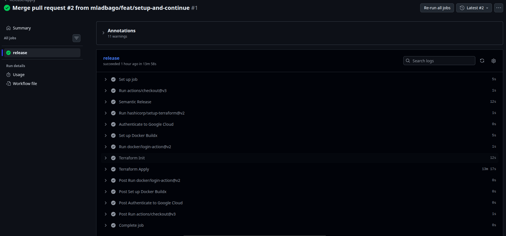


5. Analyze terraform code. Play with terraform plan, terraform graph to investigate different modules.

    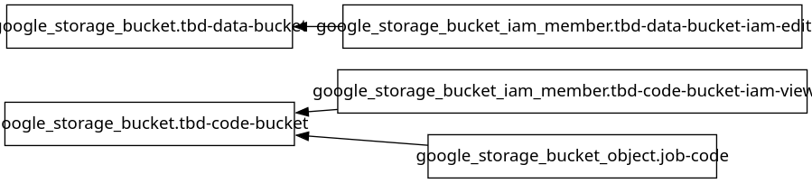

Data Pipeline module is responsible for managing Google Cloud Storage buckets and their IAM permissions. 2 buckets are created: tbd-data-bucket – stores data and tbd-code-bucket – stores code. tbd-data-bucket-iam-edit is&nbsp;applied  to data bucket to give permissions to edit. tbd-code-bucket-iam-view is applied to code bucketto give permission to view. google_storage_bucket_object.job-code bucket uploads into code bucket.

6. Reach YARN UI

   ***`gcloud compute ssh tbd-cluster-m \
    --project=$(gcloud config get-value project) \
    --zone=europe-west1-d \
    --tunnel-through-iap \
    -- -L 8088:localhost:8088 -N -n`***
   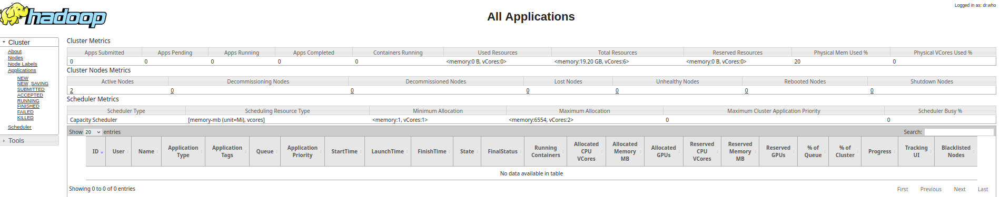
   Hint: the Dataproc cluster has `internal_ip_only = true`, so you need to use an IAP tunnel.
   See: `gcloud compute ssh` with `-- -L <local_port>:localhost:<remote_port>` and `--tunnel-through-iap` flag.
   YARN ResourceManager UI runs on port **8088**.

7. Draw an architecture diagram (e.g. in draw.io) that includes:
    1. Description of the components of service accounts
    2. List of buckets for disposal

    ***place your diagram here***

8. Create a new PR and add costs by entering the expected consumption into Infracost
For all the resources of type: `google_artifact_registry_repository`, `google_storage_bucket`
create a sample usage profiles and add it to the Infracost task in CI/CD pipeline. Usage file [example](https://github.com/infracost/infracost/blob/master/infracost-usage-example.yml)

   ***place the expected consumption you entered here***
```yaml
version: 0.1
resource_usage:
  module.gcr.google_artifact_registry_repository.registry:
    storage_gb: 15

  module.data-pipelines.google_storage_bucket.tbd-code-bucket:
    storage_gb: 1
    monthly_class_a_operations: 100
    monthly_class_b_operations: 500

  module.data-pipelines.google_storage_bucket.tbd-data-bucket:
    storage_gb: 50
    monthly_class_a_operations: 5000
    monthly_class_b_operations: 20000

  module.dataproc.google_storage_bucket.dataproc_staging:
    storage_gb: 10
    monthly_class_a_operations: 1000
    monthly_class_b_operations: 5000

  module.dataproc.google_storage_bucket.dataproc_temp:
    storage_gb: 20
    monthly_class_a_operations: 2000
    monthly_class_b_operations: 10000
```
  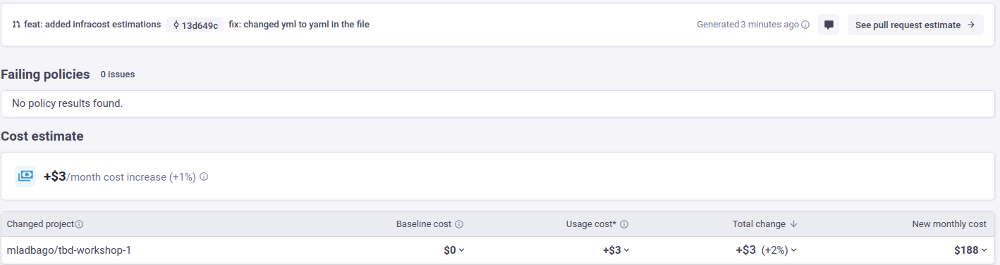
  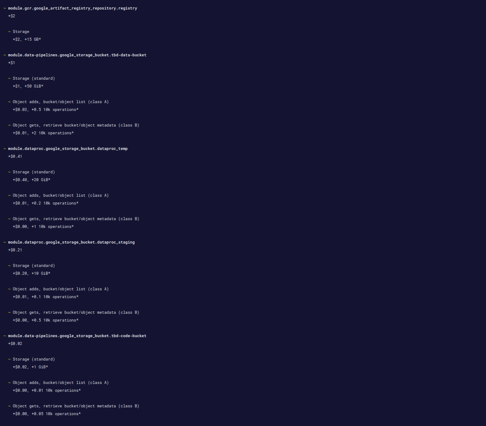

9. Find and correct the error in spark-job.py

    After `terraform apply` completes, connect to the Airflow cluster:
    ```bash
    gcloud container clusters get-credentials airflow-cluster --zone europe-west1-b --project PROJECT_NAME
    ```
    
    Then check the external IP (AIRFLOW_EXTERNAL_IP) of the webserver service:
    kubectl get svc -n airflow airflow-webserver                                                                                                                                                                 
                                              
                                                                                                                                                                                                               
    ▎ Note: If EXTERNAL-IP shows <pending>, wait a moment and retry — LoadBalancer IP allocation may take 1-2 minutes.  

    DAG files are synced automatically from your GitHub repo via git-sync sidecar.
    Airflow variables and the `google_cloud_default` GCP connection are also configured by Terraform.

    a) In the Airflow UI (http://AIRFLOW_EXTERNAL_IP:8080, login: admin/admin), find the `dataproc_job` DAG, unpause it and trigger it manually.

    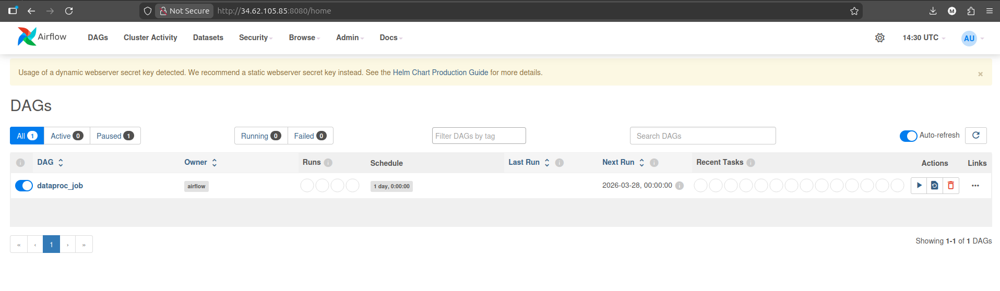

    b) The DAG will fail. Examine the task logs in the Airflow UI to find the root cause.

    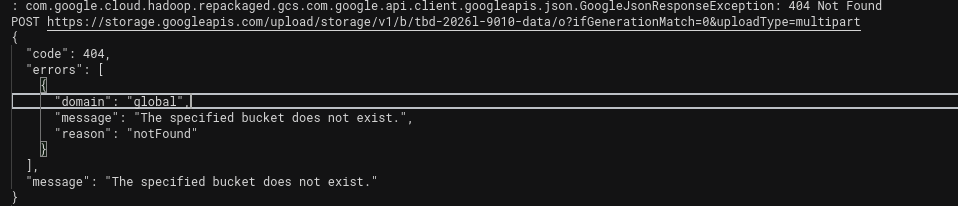

    As shown on the logs above, error is 404 Not Found signalling a problem when trying to write into storage: bucket tbd-2026l-9010-data doesn’t exist. According to that, file modules/data-pipeline/resources/spark-job.py was modified as it specified this bucket in DATA_BUCKET variable.

    c) Fix the error in `modules/data-pipeline/resources/spark-job.py` and re-upload the file to GCS:
    ```bash
    gsutil cp modules/data-pipeline/resources/spark-job.py gs://PROJECT_NAME-code/spark-job.py
    ```
    Then trigger the DAG again from the Airflow UI.

    **Fixed Script:** [spark-job.py](./modules/data-pipeline/resources/spark-job.py)

    d) Verify the DAG completes successfully and check that ORC files were written to the data bucket:
    ```bash
    gsutil ls gs://PROJECT_NAME-data/data/shakespeare/
    ```

    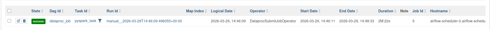

11. Create a BigQuery dataset and an external table using SQL

    Using the ORC data produced by the Spark job in task 9, create a BigQuery dataset and an external table.

    Note: the dataset must be created in the same region as the GCS bucket (`europe-west1`), e.g.:
    ```bash
    bq mk --dataset --location=europe-west1 shakespeare
    ```

    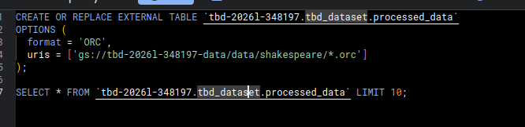
    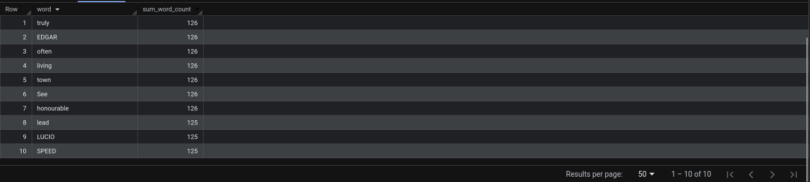

    Then create an external table using the ORC files in GCS. You can do this via the BigQuery UI or CLI, e.g.:

    ***why does ORC not require a table schema?***

    ORC is self-describing format, which means that user doesn’t have to manually define table schema. Schema is defined in file footer, that includes metadata: column names, data types, structure. Compared to other formats (that do require table schema) schema travels with the data, ORC isn’t just a text file. This allows schema evolution – adding/replacing columns and easier data sharing as seperate schema file is unnecessary.

12. Add support for preemptible/spot instances in a Dataproc cluster

**Modified file:** [modules/dataproc/variables.tf](./modules/dataproc/variables.tf)

```hcl
variable "preemptible_worker_instances" {
  type    = number
  default = 2
}
```
**Modified file:** [modules/dataproc/main.tf](./modules/dataproc/main.tf)
```hcl
preemptible_worker_config {
  num_instances = var.preemptible_worker_instances
}
```
13. Triggered Terraform Destroy on Schedule or After PR Merge. Goal: make sure we never forget to clean up resources and burn money.

Add a new GitHub Actions workflow that:
  1. runs terraform destroy -auto-approve
  2. triggers automatically:

   a) on a fixed schedule (e.g. every day at 20:00 UTC)

   b) when a PR is merged to master containing [CLEANUP] tag in title

Steps:
  1. Create file .github/workflows/auto-destroy.yml
  2. Configure it to authenticate and destroy Terraform resources
  3. Test the trigger (schedule or cleanup-tagged PR)

Hint: use the existing `.github/workflows/destroy.yml` as a starting point.

```
name: Auto-Destroy
on:
  schedule:
    - cron: '0 20 * * *'

  pull_request:
    branches: [master]
    types: [closed]

  workflow_dispatch:

permissions: read-all
jobs:
  auto-destroy:
    if: |
      github.event_name == 'schedule' || 
      github.event_name == 'workflow_dispatch' || 
      (github.event.pull_request.merged == true && contains(github.event.pull_request.title, '[CLEANUP]'))
    runs-on: ubuntu-latest
  # Add "id-token" with the intended permissions.
    permissions:
      contents: write
      id-token: write
      pull-requests: write
      issues: write

    steps:
    - uses: 'actions/checkout@v3'
    - uses: hashicorp/setup-terraform@v2
      with:
        terraform_version: 1.11.0
    - id: 'auth'
      name: 'Authenticate to Google Cloud'
      uses: 'google-github-actions/auth@v1'
      with:
        token_format: 'access_token'
        workload_identity_provider: ${{ secrets.GCP_WORKLOAD_IDENTITY_PROVIDER_NAME }}
        service_account: ${{ secrets.GCP_WORKLOAD_IDENTITY_SA_EMAIL }}
    - name: Terraform Init
      id: init
      run: terraform init -backend-config=env/backend.tfvars
    - name: Terraform Destroy
      id: destroy
      run: terraform destroy -no-color -var-file env/project.tfvars -auto-approve
      continue-on-error: false
```

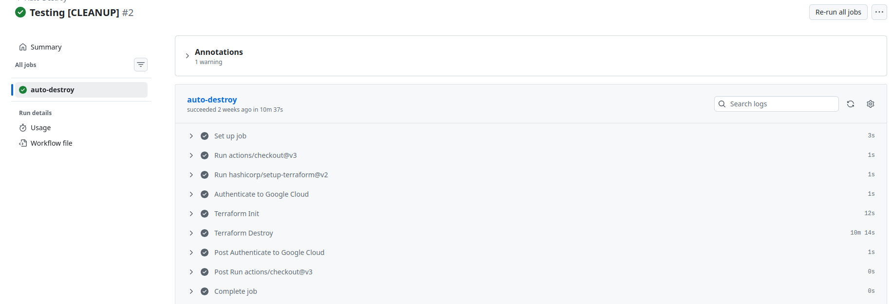

***Scheduling a cleanup acts as a financial safety net, ensuring that expensive resources like Dataproc clusters don't accidentally stay active overnight or over the weekend if you forget to manually destroy them after a long coding session.***

Scheduling cleanup is helpful to ensure that resources are used efficiently (infrastructure generates costs only when in use) and to reduce manual intervention.
